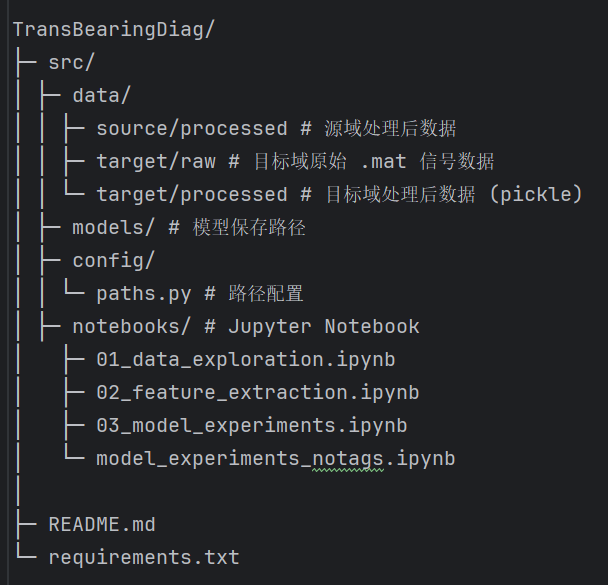

# TransBearingDiag

**TransBearingDiag** 是一个用于滚动轴承信号分析的深度学习项目，支持：

- 源域训练
- 目标域无标签数据处理
- 迁移学习（卷积迁移）
- 卷积特征可视化

项目主要流程包括：

1. 源域数据训练
2. 目标域无标签数据处理与分帧
3. 卷积迁移学习训练目标域模型
4. 卷积特征提取与可视化

---


## 目录结构





---

## 功能模块概述

### 1️⃣ 源域训练（Source Domain Training）

**功能**：对已有标签的源域数据训练 CNN1D，并保存模型权重。  

**处理步骤**：

1. **加载源域数据**  
   - 从 `train_val_test_split.pkl` 中读取训练集、验证集、测试集及标签。

2. **标签编码**  
   - 使用 `LabelEncoder` 编码字符串标签为整数。
   - 输出类别映射，如 `{‘正常’: 0, '内圈故障':1, '外圈故障':2}`。
   - 转换为 `torch.Tensor`。

3. **数据加载器**  
   - 使用 `DataLoader` 构建训练、验证和测试集。

4. **CNN1D 模型结构**  
   - 输入：1D 信号（单通道）  
   - 卷积层：`Conv1d -> ReLU -> Conv1d -> ReLU -> MaxPool -> Conv1d -> ReLU -> MaxPool`  
   - 全连接层：`Linear -> ReLU -> Linear -> 输出类别数`  
   - 动态计算卷积输出尺寸，确保全连接层输入匹配。

5. **模型训练**  
   - 损失函数：交叉熵  
   - 优化器：Adam  
   - 输出每个 epoch 平均损失

6. **模型保存**  
   - 卷积层权重：`model_src.pth`  
   - 完整模型：`full_model_src.pth`

---

### 2️⃣ 目标域无标签数据处理（Target Domain Unlabeled Data）

**功能**：读取目标域原始信号，分帧处理，为迁移学习做准备。  

**处理步骤**：

1. **读取目标域 `.mat` 文件**  
   - 提取信号，堆叠成 `X_target_raw`。

2. **划分训练/验证/测试集**  
   - 比例：训练 64%，验证 16%，测试 20%。

3. **数据分帧**  
   - 使用函数 `split_signal(data, frame_len=128, step=64)`  
   - 输出：`X_train_tgt_frames`, `X_val_tgt_frames`, `X_test_tgt_frames`

4. **数据保存**  
   - 使用 `joblib.dump` 保存为 `target_data.pkl`  

5. **构建 DataLoader**  
   - 定义 `TargetDataset` 类  
   - 支持批训练

---

### 3️⃣ 卷积迁移学习（Transfer Learning）

**功能**：使用源域训练好的卷积层作为特征提取器，迁移到目标域无标签数据进行自监督训练。  

**处理步骤**：

1. **加载源域卷积层权重**  
   - 仅卷积层权重 `model_src.pth`，全连接层随机初始化。

2. **构建目标域 CNN1D 模型**  
   - 冻结卷积层：`requires_grad=False`  
   - 微调：解冻部分卷积层

3. **目标域训练（无标签）**  
   - 损失函数：L2 自监督损失 `loss = mean(outputs ** 2)`  
   - 优化器：Adam  
   - 保存模型：  
     - 权重：`model_tgt_notags.pth`  
     - 完整模型：`full_model_tgt_notags.pth`

---


---


### 安装依赖

```bash
pip install -r requirements.txt


